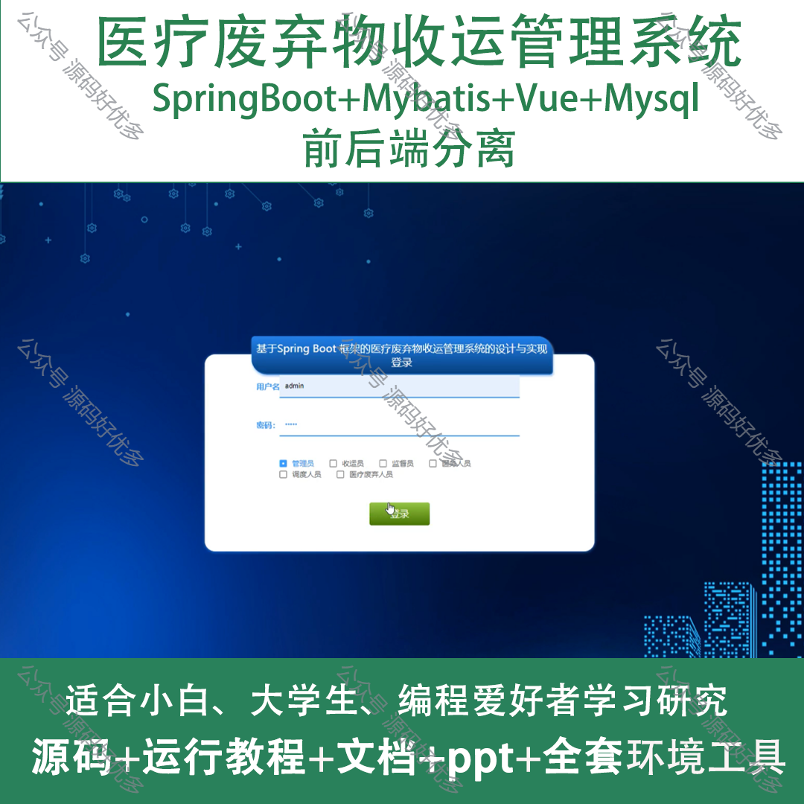
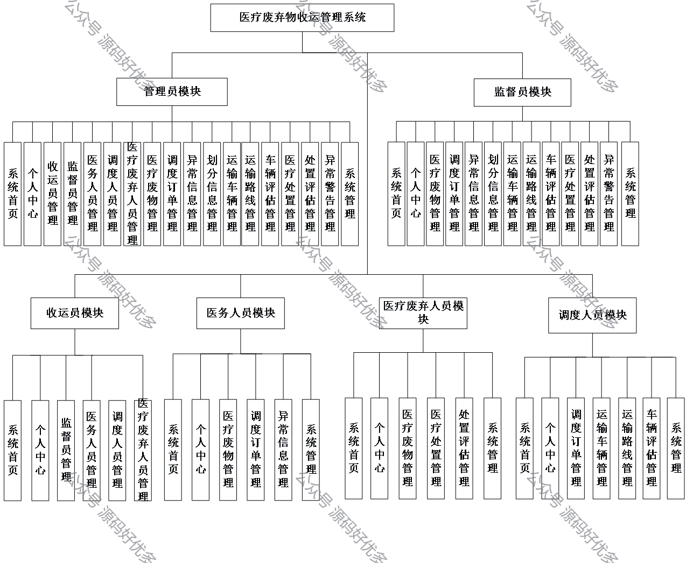
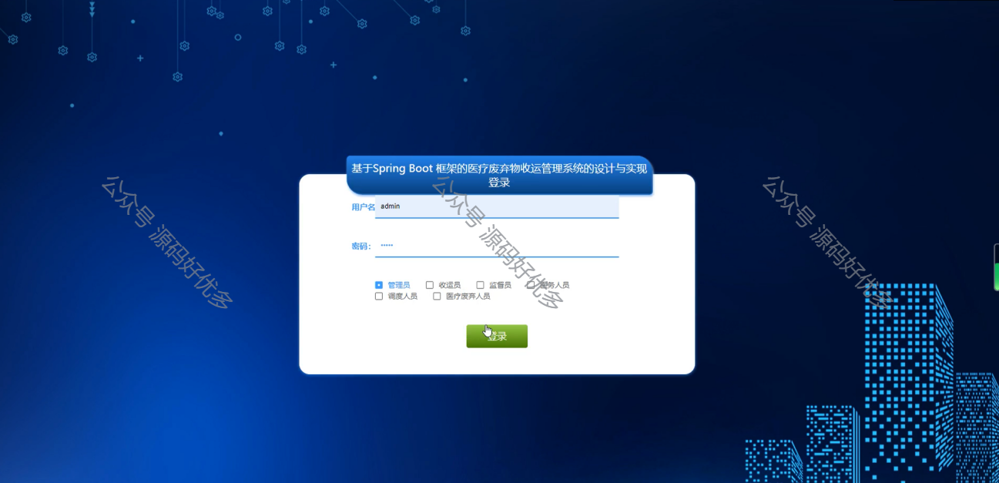
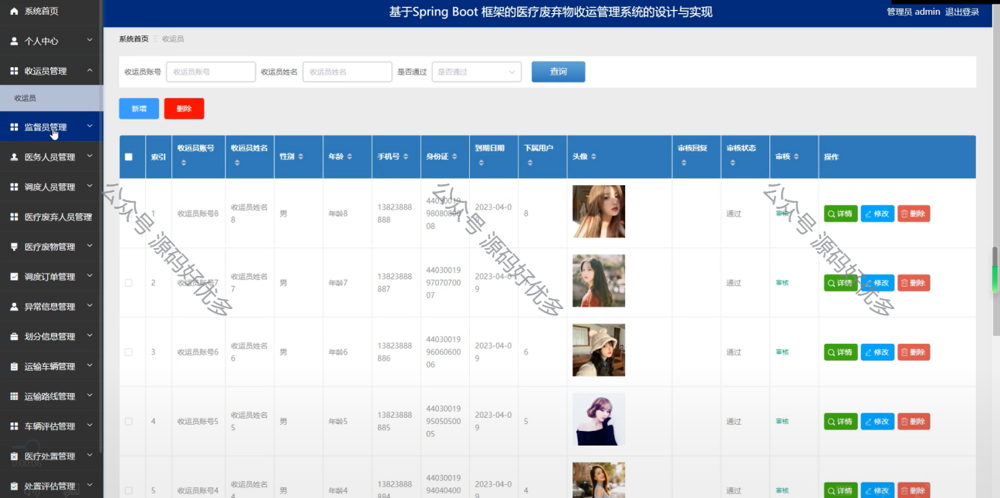
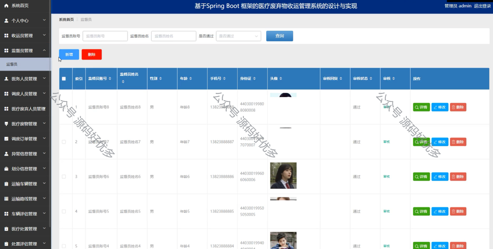
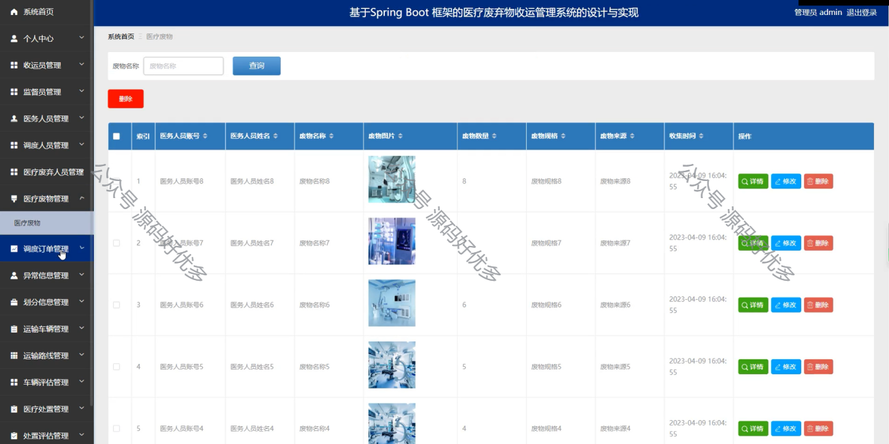
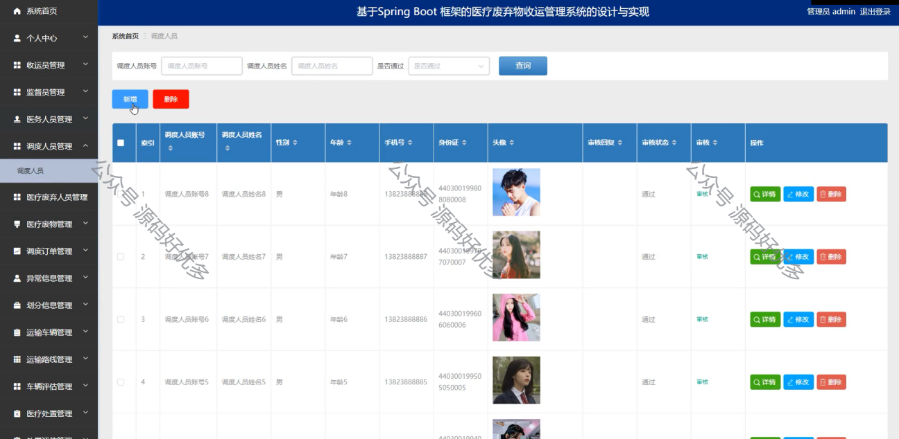
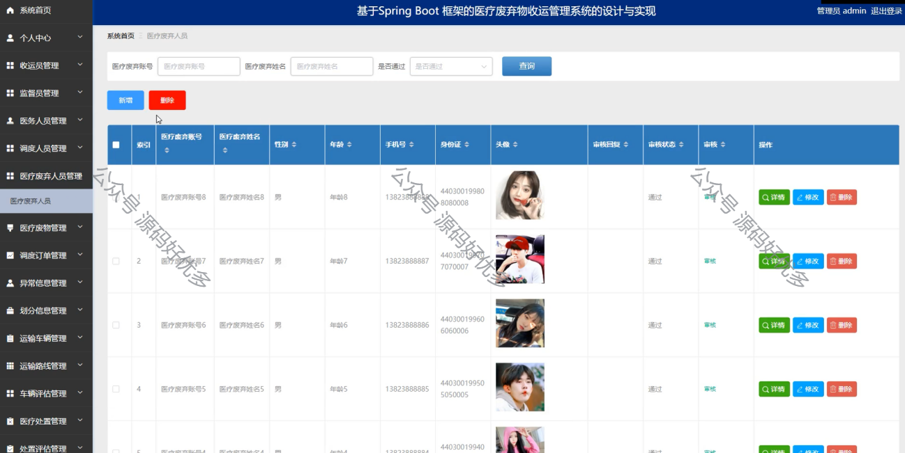
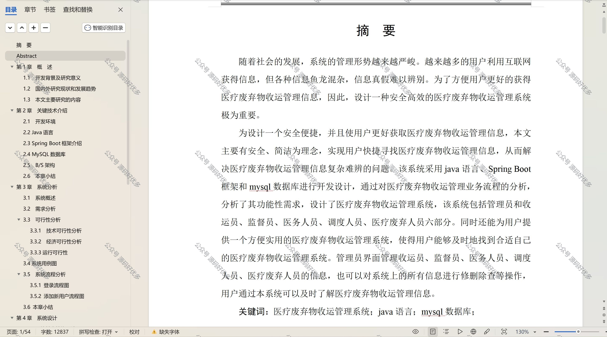

 
## 查看主页获取源码

> **作者介绍**： **✌**全网粉丝10W+本平台特邀作者、博客专家、CSDN新星计划导师、java领域优质创作者,博客之星、掘金/华为云/阿里云/InfoQ等平台优质作者、专注于项目实战 **✌**

  

### 一、作品包含

源码+数据库+设计文档万字+PPT+全套环境和工具资源+部署教程

### 二、项目技术

前端技术：Html、Css、Js、Vue、Element-ui

数据库：MySQL

后端技术：Java、Spring Boot、MyBatis

  

### 三、运行环境

开发工具：IDEA/eclipse

数据库：MySQL5.7

数据库管理工具：Navicat10以上版本

环境配置软件： JDK1.8+Maven3.6.3

前端Nodejs：14

### 四、项目介绍
项目编号：springbootA115

医疗废弃物收运管理系统是在医疗行业对废弃物处理要求日益严格，以及环保法规日益完善的背景下，应运而生的一套专门用于医疗废弃物收集、运输和处理的信息化管理系统，旨在帮助医疗机构提高废弃物处理效率，确保废弃物安全合规处理，减少环境污染，推动医疗废弃物管理的科学化和规范化。

系统分为管理员、监督员、收运员、医务人员、医疗废弃人员、调度人员
管理员的功能：系统首页、个人中心、收运员管理、监督员管理、医务人员管理、调度人员管理、医疗废弃人员管理、医疗废物管理、调度订单管理、异常信息管理、划分信息管理、运输路线管理、车辆评估管理、医疗处置管理、处置评估管理、异常警告管理、系统管理。
监督员的功能：个人中心、医疗废物管理、调度订单管理、异常信息管理、划分信息管理、运输车辆管理、运输路线管理、车辆评估管理、医疗处置管理、处置评估管理、异常警告管理、系统管理。
收运员的功能：系统首页、个人中心、监督员管理、医务人员管理、调度人员管理和医疗废弃人员管理。
医务人员的功能：系统首页、个人中心、医疗废物管理、调度订单管理、异常信息管理和系统管理。
医疗废弃人员的功能：系统首页、个人中心、医疗废物管理、医疗处置管理、处置评估管理、系统管理。
调度人员的功能：系统首页、个人中心、调度订单管理、运输车辆管理、运输路线管理、车辆评估管理和系统管理。
### 五、运行截图

  
